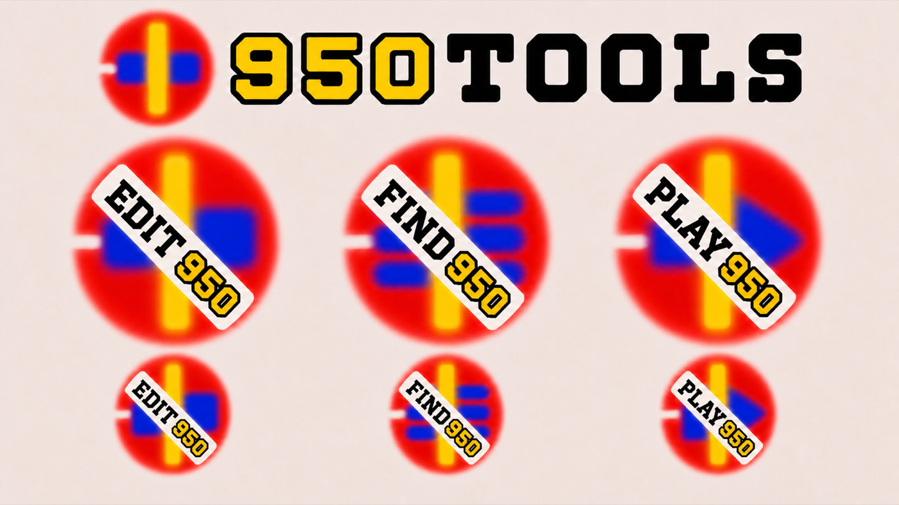
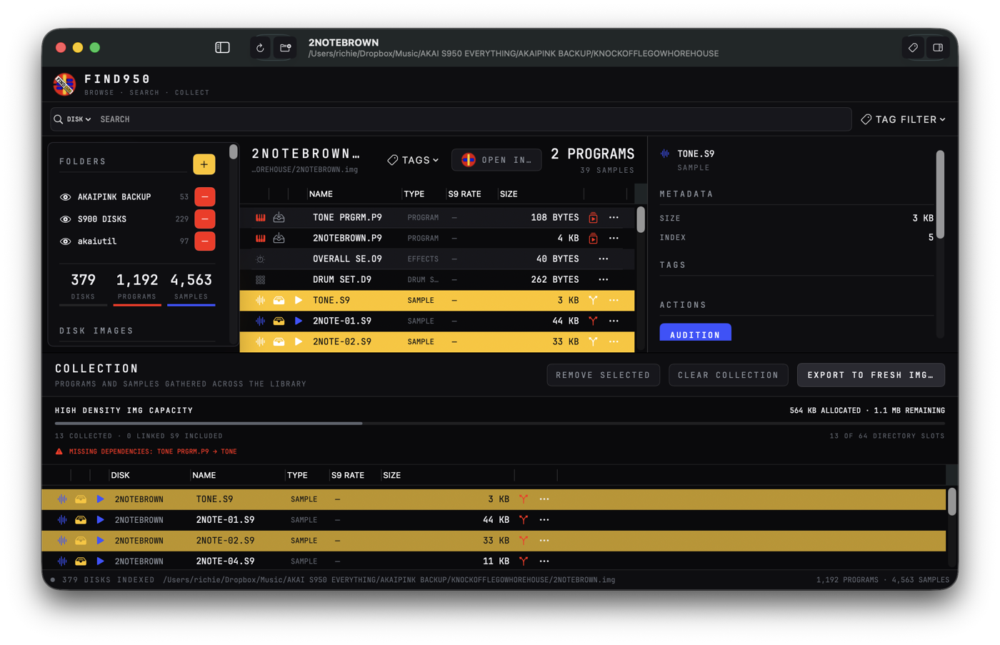
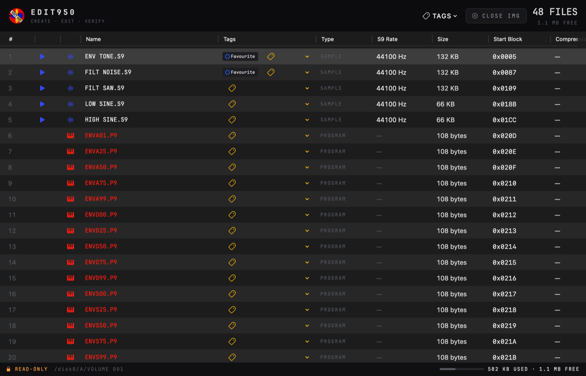
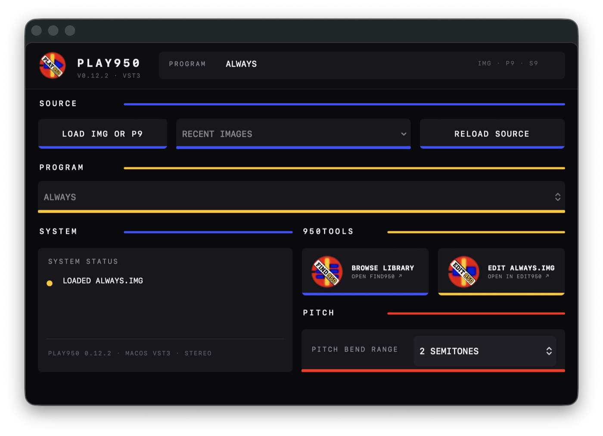

# 950TOOLS

<p align="center">
  
</p>

<p align="center"><strong>FIND · EDIT · PLAY</strong></p>

[](https://github.com/richiewarburton/950TOOLS/actions/workflows/contracts.yml)
[](LICENSE)



## Your old S900/S950 disks are still usable

If you backed up your sampler floppies as `.img` files—perhaps with a
Greaseweazle, a Gotek workflow, or an older disk-imaging setup—the sounds,
programs, keygroups, tuning and loops are still in those images. The awkward
part is finding and using them on a modern Mac.

950TOOLS is a set of open-source macOS projects for that job:

- search a folder containing hundreds or thousands of disk images;
- audition the samples without changing the original IMG files;
- open and edit native S9 samples and P9 programs safely;
- collect a program and all of its linked samples into a smaller working IMG;
- play the original program mapping in a DAW; and
- save the sound with the DAW project so it can be recalled later.

You do **not** need a working S900 or S950 to browse, audition, edit or use the
archive in a DAW. If you still have the sampler, the resulting IMG files can
also fit into your existing Gotek, USB or disk-writing workflow.

> **Find in FIND950, modify in EDIT950, play and recall in PLAY950.**

## See the tools

### Search the archive — FIND950


Browse and search many disk images, audition S9 samples, add tags and follow the
native relationship from a sample back to every P9 program that uses it.



### Inspect and edit — EDIT950


Open one IMG in detail, hear its samples, inspect or edit native program data,
export WAVs and safely prepare 800 KB or 1.6 MB working images.



### Play in the DAW — PLAY950


Load an IMG or P9 into the VST3, play its original mapping from MIDI and save the
required native content with the DAW project for later recall.



## Which project do I need?

| I want to… | Use… |
| --- | --- |
| See what is inside one IMG, export WAVs, edit programs/samples, or create working images | [EDIT950](https://github.com/richiewarburton/EDIT950) |
| Search and tag an entire folder of IMG backups, audition sounds, or find every program using a sample | [FIND950](https://github.com/richiewarburton/FIND950) |
| Load the original programs into a DAW and recall them with the session | [PLAY950](https://github.com/richiewarburton/PLAY950) |

The easiest place to start is **EDIT950** if you have one or two
images to inspect. Add **FIND950** when you want your whole archive
to feel searchable. PLAY950 is the DAW instrument side of the workflow.

## How to use the 950TOOLS workflow

1. Image the old disks without modifying them.
2. Put the resulting `.img` files in an organised folder on your Mac and keep a
   separate archival backup.
3. Point FIND950 at the folder. It builds a searchable catalogue
   and subsequently rereads only new or changed images.
4. Search for a remembered program or audition samples until you find the right
   sound.
5. Open it in EDIT950 to inspect or edit it, or ask EDIT950 to make a focused 800 KB or
   1.6 MB IMG containing that P9 and all of its linked S9 samples.
6. Load the program in PLAY950 inside the DAW. PLAY950 stores the required
   native content with the project, so recall does not depend on the original
   IMG remaining at the same path.

You can also deliberately keep the floppy-disk discipline. Ask EDIT950 to make a
fresh 800 KB or 1.6 MB image, treat its directory slots and sample memory as a
hard creative budget, and use only the programs and samples that fit. PLAY950
then plays that deliberately constrained disk in the DAW without removing the
decisions imposed by the original medium.

The original archive remains the source of truth. FIND950 and PLAY950
open source images read-only. EDIT950 is the only application that writes IMG
files, and its mutation workflows use staging, verification, backup and
rollback where applicable.

## IMG and hardware compatibility

- Standard S900/S950 `.img` disk images are the main workflow.
- If Greaseweazle already produced an IMG file, you can use that file directly.
- Raw flux captures, `.scp` and `.hfe` files are not opened directly. Preserve
  those masters and export or convert a compatible IMG copy first.
- EDIT950 can also inspect supported ISO and compatible raw-image layouts;
  FIND950 currently indexes IMG files.
- These applications work with image files, not physical floppy drives. They do
  not format or write a real drive.
- Owning the original sampler is optional. PLAY950 models the supported S950
  playback behaviour for DAW use; it is not presented as a component-perfect
  hardware emulation.

## Current availability

- **EDIT950** is a working native macOS application; the repository documents
  the current source build and release status.
- **FIND950** is working and currently installed from source with Xcode; a
  packaged public release is still to come.
- **PLAY950** is a working development VST3 project built from source; a
  packaged public plug-in release is still to come.

All three target macOS 14 or later. See each product README for exact build,
installation and current-scope details.

## Why three applications?

The separation is a safety feature, not three copies of the same utility:

- FIND950 can search and audition but cannot issue mutating AKAI Util
  commands.
- EDIT950 owns all deliberate IMG creation and modification.
- PLAY950 owns real-time playback and DAW project recall, never media editing.

This repository holds the contracts and acceptance criteria that keep those
responsibilities consistent. It does not contain the application source.

## Protocol and project documents

- [Architecture](docs/ARCHITECTURE.md)
- [Interoperability protocol v1](docs/INTEROP-PROTOCOL-V1.md)
- [Delivery roadmap](docs/ROADMAP.md)
- [Cross-project acceptance](docs/ACCEPTANCE.md)
- [Implementation baseline](docs/BASELINE.md)
- [Phase 1 compatibility record](docs/PHASE1-COMPATIBILITY.md)

Machine-readable JSON Schemas live in `schemas/`. Validate the schemas and
examples with:

```sh
npm install
./scripts/validate-contracts.sh
```

## Licence

The 950TOOLS contracts and documentation are available under the
[MIT License](LICENSE). Third-party products, formats, trademarks and test media
retain their respective rights. This is an independent project and is not
affiliated with or endorsed by Akai Professional.
